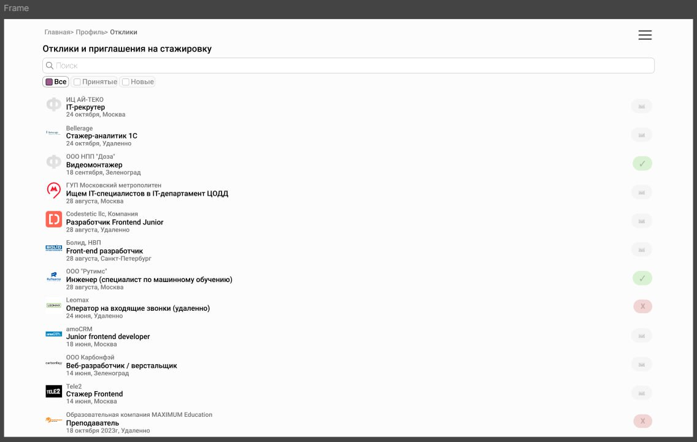

# ТЗ на фронтенд страницы откликов и приглашений на стажировку

## 1. Макет страницы



## 2. SEO

URL страницы: /internship-responses

Хлебные крошки: Главная > Профиль > Отклики

## 3. JSON при инициализации

```json
[
  {
    "company": "ИЛ АЙ-ТЕКО",  
    "position": "IT-рекрутер",
    "date": "24.10.2024",
    "status": 0,
    "location": "Москва",
    "companyLogo": "https://example.com/logos/il-iteco.png"
  },
  {
    "company": "Bellerage",
    "position": "Стажер-аналитик",
    "date": "24.10.2024",
    "status": 0,
    "location": "Удаленно",
    "companyLogo": "https://example.com/logos/bellerage.png"
  },
  {
    "company": "ООО НПП \"Доза\"",
    "position": "Видеомонтажер",
    "date": "18.09.2024",
    "status": 1,
    "location": "Зеленоград",
    "companyLogo": "https://example.com/logos/doza.png"
  },
  {
    "company": "ГУП Московский метрополитен",
    "position": "IT-специалист в ЦОДД",
    "date": "28.08.2024",
    "status": 0,
    "location": "Москва",
    "companyLogo": "https://example.com/logos/moscow-metro.png"
  },
  {
    "company": "Codestetic llc",
    "position": "Разработчик Frontend Junior",
    "date": "28.08.2024",
    "status": 0,
    "location": "Удаленно",
    "companyLogo": "https://example.com/logos/codestetic.png"
  },
  {
    "company": "Болид, НПП",
    "position": "Front-end разработчик",
    "date": "28.08.2024",
    "status": 0,
    "location": "Санкт-Петербург",
    "companyLogo": "https://example.com/logos/bolid.png"
  },
  {
    "company": "ООО \"Рутим\"",
    "position": "Инженер (ML-специалист)",
    "date": "28.08.2024",
    "status": 1,
    "location": "Москва",
    "companyLogo": "https://example.com/logos/rutim.png"
  },
  {
    "company": "Leomax",
    "position": "Оператор на входящие звонки",
    "date": "24.06.2024",
    "status": -1,
    "location": "Удаленно",
    "companyLogo": "https://example.com/logos/leomax.png"
  },
  {
    "company": "amoCRM",
    "position": "Junior frontend developer",
    "date": "18.06.2024",
    "status": 0,
    "location": "Москва",
    "companyLogo": "https://example.com/logos/amocrm.png"
  },
  {
    "company": "ООО Карбонфэй",
    "position": "Веб-разработчик / верстальщик",
    "date": "14.06.2024",
    "status": 0,
    "location": "Зеленоград",
    "companyLogo": "https://example.com/logos/karbofay.png"
  },
  {
    "company": "Tele2",
    "position": "Стажер Frontend",
    "date": "14.06.2024",
    "status": 0,
    "location": "Москва",
    "companyLogo": "https://example.com/logos/tele2.png"
  },
  {
    "company": "Образовательная компания MAXIMUM Education",
    "position": "Преподаватель",
    "date": "18.10.2023",
    "status": -1,
    "location": "Удаленно",
    "companyLogo": "https://example.com/logos/maximum-education.png"
  }
]

```

## 4. Маппинг данных

### Элементы списка откликов/приглашений

Скриншот элемента: [Скриншот элемента в макете]

Условие отображения: Всегда

Описание элемента:

| Элемент | Тип элемента | Поле из JSON | Примечание |
|---------|--------------|--------------|------------|
| Логотип компании | Изображение | companyLogo | Отображается логотип компании |
| Название компании | Текст | company | Кликабельно, ведет на страницу компании |
| Должность | Текст | position | - |
| Местоположение |Текст|location| Место работы потенциального сотрудника |
| Дата | Текст | date | Дата отклика на вакансию |
| Статус | Число | status | Отображается цветом в соответствии со статусом (Принят - зеленый, Отклик - серый, Отказ - красный) |
| Иконка статуса | Изображение | - | Отображается иконка в соответствии со статусом |

## 5. Действия на странице

| Действие | Формат вызова функции | Эндпоинт | Примечание |
|----------|------------------------|----------|------------|
| Фильтрация откликов/приглашений | Клик по чекбоксам ("Все", "Принятые", "Новые") | - | Фильтрует список в соответствии с выбранным статусом |
| Поиск по откликам/приглашениям | Ввод текста в поле поиска | - | Фильтрует список в соответствии с введенным текстом |
| Переход на страницу компании | Клик по названию компании | GET /company/{companyId} | Открывает страницу выбранной компании |

